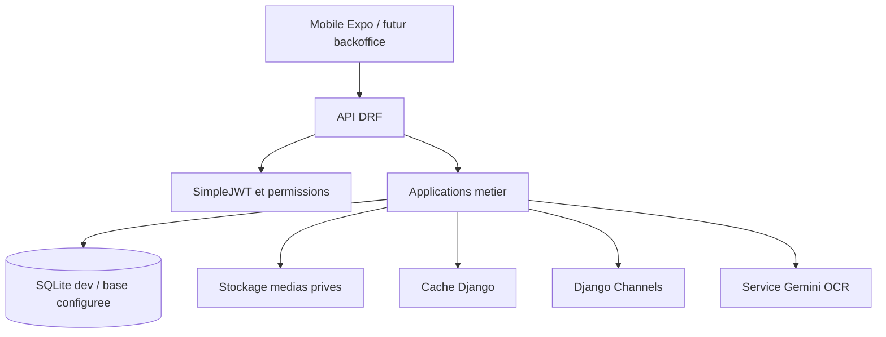
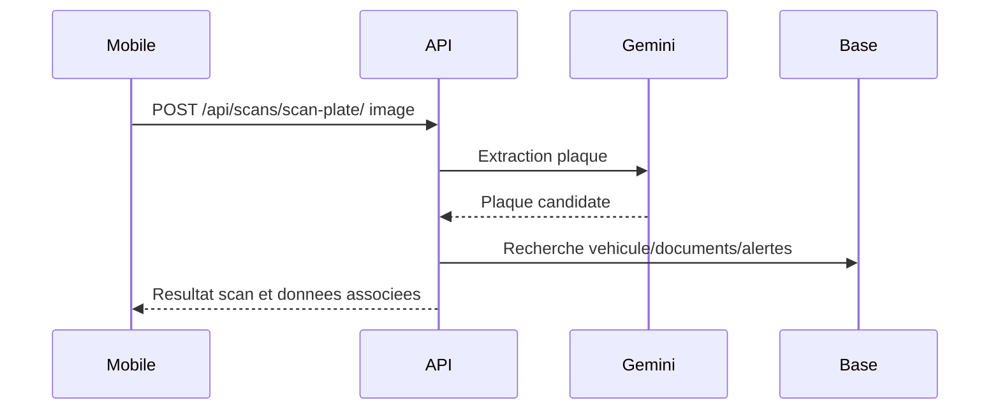
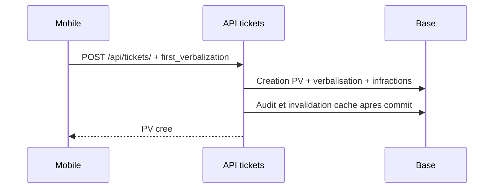

# Architecture Backend

## Vue D'Ensemble

Le backend SmartRoute est une application Django REST Framework organisee par domaines metier. Il expose des API JSON, des endpoints multipart pour les medias, une documentation OpenAPI et un canal WebSocket pour les alertes.

## Applications

- `accounts`: utilisateurs, types de comptes, profils agents, auth mobile, signature, changement de mot de passe.
- `owners`, `vehicles`, `drivers`, `documents`, `insurance`: donnees administratives et recherches.
- `scans`, `gemini`: scan de plaque, historique et integration OCR.
- `infractions`, `tickets`, `delits`: catalogue, PV, verbalisation et dossiers de delits.
- `alerts`: alertes terrain/administratives, preuves, WebSocket et expiration.
- `dashboard`, `reports`: statistiques et rapports.
- `sync`: synchronisation offline mobile/backend.
- `media_storage`: validation, chemins et controles des fichiers.
- `core`: enveloppe API, audit, cache, middleware et securite transverse.

## Flux Requete/Reponse

1. Le client appelle une route sous `/api/` avec JWT lorsque requis.
2. DRF applique authentification, permissions et serializers.
3. Le module metier lit ou modifie la base.
4. Les effets secondaires passent par services, audit, cache ou stockage media.
5. La reponse est enveloppee par `success`, `message`, `data`, `errors`, sauf quelques endpoints historiques ou directs documentes.

## Environnements

- Developpement: `config.settings.dev`, `DEBUG=True`, SQLite par defaut, Redis optionnel.
- Tests: `config.settings.test`, hash MD5, cache memoire, logging reduit.
- Production: `config.settings.prod`, garde-fous de securite, HTTPS et variables obligatoires.

## Cache, Channels Et Redis

`USE_REDIS=False` utilise `LocMemCache` et un channel layer memoire. `USE_REDIS=True` active Redis pour le cache et Channels via `REDIS_URL`. Redis est recommande hors developpement mono-processus.

## Medias

Les medias sensibles ne sont pas servis comme fichiers publics directs. Les chemins et validations sont centralises dans `apps.media_storage.services`; les lectures passent par endpoints authentifies quand le contenu est prive.

## Flux Critiques

